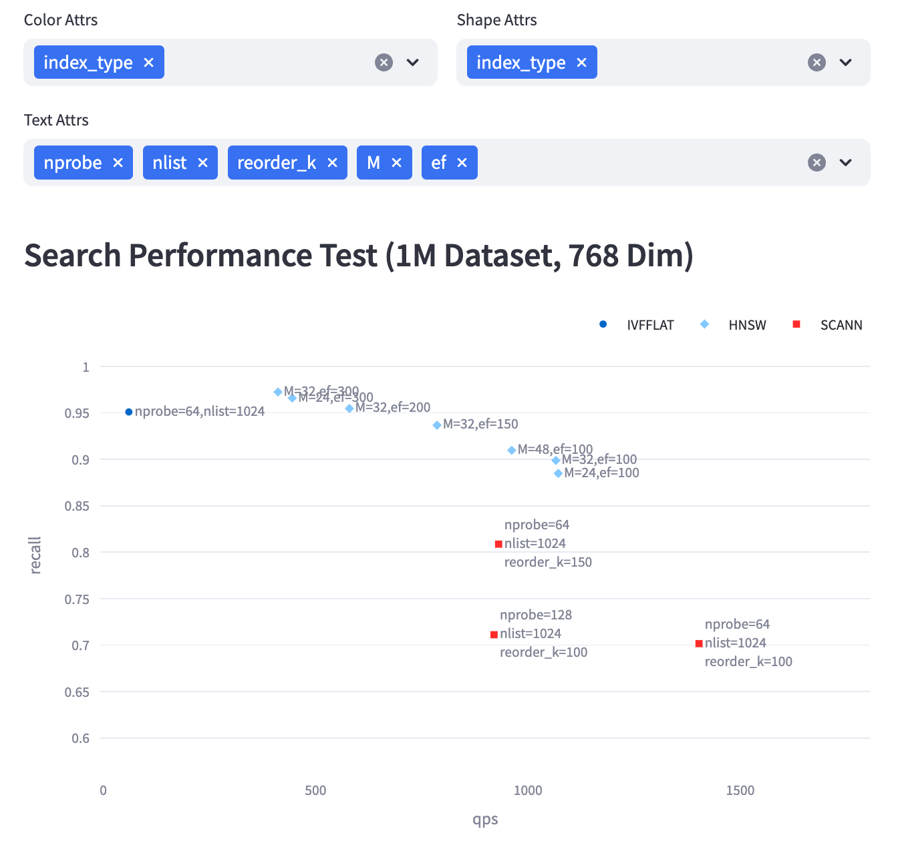

# Vector Database Benchmark for Library

VDBBench now support testing vector indexing libraries (faiss, knowhere, etc.)
Unlike database, library cannot be a separate standalone service. When testing, vdbbench will generate a new process on the same machine to call the **python API of library** for testing.


## What VDBBench for Library can do

Considering that we are using the library's python interface and not native C++, and that VDBBench itself has resource consumption, VDBBench For Library is **not suitable for absolute standard performance testing**.

The advantages of VDBBench are mainly:
- Built-in a large number of test scenarios, including a variety of types of datasets and filter conditions.
- Convenient web interface allows users to run tests with a single click.
- The collection, saving and display of results, suitable for performance comparison under different test parameters.

Especially after making some changes to the code, you can quickly test, compare and analyze the impact of these changes on performance.




## How VDBBench for Library do it

There are 3 main metrics for collection: `build time`, `qps`, and `recall`.

The main testing process is as follows:

- For training, insert all vector data at once. Note that scalar data will not be used, including ID. Note that ID is related to groundtruth, which determines the recall calculation, so make sure `USE_SHUFFLED_DATA` is False.

- For general performance testing, combine all query vectors together for a single large NQ, collect the results and record the response time to calculate QPS and Recall.

- For filtering performance test, since library doesn't store any scalar data, we will prepare an extra data `[valid_ids]` for each filter-expr to record all the vector ids that satisfy the conditions. Library client can convert the valid_ids into the data format (e.g. bitset) that it needs.

## Knowhere-py Client

At the moment, we support knowhere first, the detailed usage flow is as follows
- install
    - clone vdbbench
    ```sh
    git clone git@github.com:zilliztech/VDBBench.git
    ```
    - switch branch
    ```sh
    git checkout library_test
    ```
    - install dependencies
    ```sh
    pip install -e '. [test]'
    ```

- test
    - Compile pyknowhere, make sure to use "--force-reinstall" when installing to ensure that you are testing knowhere with the latest changes applied.
    ```sh
    cd python
    python3 setup.py bdist_wheel
    pip3 install dist/*.whl --force-reinstall
    ```
    - Start vdbbench
    ```sh
    init_bench
    ```
    - Open the [run_test page](http://localhost:8501/run_test). If you are testing on a server, make sure that port 8501 of the server is open.
    - Select client, case, prepare parameters, and submit the test. Note that the config should strictly conform to the json format (as shown in the sample, "M": 24, "efConstruction": 100, "ef": 100)
    - Wait for the test to complete and then open the [library page](http://localhost:8501/library_results) and configure the parameters you need to analyze.


## Faiss Client

One the way

